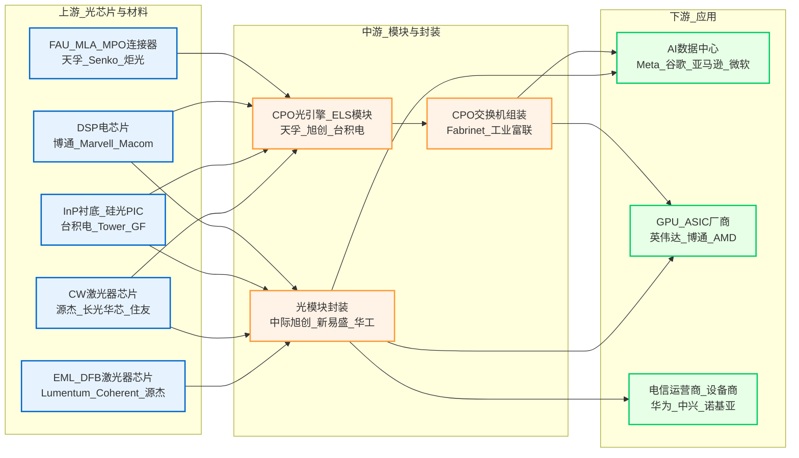

# 光模块与CPO主题关联上市公司分析报告

**生成时间**: 2026年3月12日

---

## 1. 主题概述

### 1.1 核心观点

光模块与CPO（共封装光学）是当前AI算力基础设施领域确定性最高、景气度最强的投资主线。随着全球AI大模型训练与推理需求爆发式增长，数据中心对高速光互连的需求从800G加速向1.6T/3.2T演进，光模块市场正迎来新一轮量价齐升周期。与此同时，CPO作为解决Scale-Up场景功耗与带宽瓶颈的核心技术路径，已于2026年正式进入商用元年，英伟达、博通等巨头明确部署时间表，产业链核心厂商订单爆满、产能告急，标志着CPO从远期叙事迈入确定性爆发拐点。

**投资价值基调**：在AI算力需求远未见顶的背景下，光模块行业将持续受益于800G/1.6T产品放量及硅光渗透率提升；CPO产业链（光引擎、FAU、高功率激光器、先进封装）则将成为2026-2027年最具弹性的增量赛道，核心标的具备跨周期成长潜力。

### 1.2 核心驱动因素

- **AI算力需求持续扩张**：北美云厂商（Meta、谷歌、亚马逊、微软）资本开支持续超预期，2026年AI算力投资合计超2000亿美元；百万卡集群竞赛带动配套光模块需求激增
- **光模块产品代际升级**：800G光模块需求预计2026年达4500万只（同比+125%），1.6T光模块需求达2500-3000万只；硅光方案渗透率有望超50%，毛利率中枢上行
- **CPO技术商业化落地**：英伟达明确2026年为CPO商用元年，计划Q4启动量产；Lumentum、Coherent订单爆满，磷化铟产能预订至2027-2028年；2027年CPO交换机出货量预计达10-15万台
- **供给端紧缺格局延续**：光芯片（EML、CW激光器）供需缺口达25%-30%，已成为光模块扩产核心瓶颈，龙头物料保障能力成为核心竞争壁垒
- **政策与标准推进**：IEEE 802.3ct标准有望2026年完成，明确CPO电-光接口规范；国内"毫秒用算"专项行动计划部署400G及以上全光交换网络

### 1.3 产业链深度解析

#### 上游

- **光芯片（激光器芯片）**：包括EML芯片（边发射激光器）、DFB激光器、CW激光器（硅光外置光源）。光芯片是光模块核心器件，成本占比随速率提升而增加（800G/1.6T产品中可达20%-30%）。全球供需缺口25%-30%，高端市场由Lumentum、Coherent（博通）、住友电工主导，国产厂商源杰科技、长光华芯、云岭光电正加速突破
- **DSP芯片/电芯片**：负责信号处理与调制，主要供应商包括博通（Broadcom）、Marvell、美满电子（Macom），成本占比30%-40%
- **InP衬底/硅光PIC芯片**：磷化铟衬底是高速激光器核心材料，供给紧张；硅光PIC芯片由台积电（Tower、GlobalFoundries）代工，高端混合键合工艺仅台积电具备能力
- **无源器件（FAU/MLA/MPO连接器）**：光纤阵列单元（FAU）、微透镜阵列（MLA）、MPO连接器是CPO核心组件，单台CPO交换机FAU价值量达7200美元。主要供应商包括天孚通信、Senko、炬光科技

#### 中游

- **光模块封装**：将光芯片、电芯片、PCB结构件组装成光模块。全球龙头为中际旭创（LightCounting 2024年全球第一）、Coherent、Lumentum、新易盛、华工科技、光迅科技。硅光模块占比持续提升，良率与功耗优势显著
- **CPO光引擎/模组**：集成光收发功能的核心组件，单台CPO交换机光引擎价值量达3.6万美元。台积电COUPE平台主导先进封装，天孚通信、旭创、新易盛切入光引擎组装环节
- **外置激光源模块（ELS）**：CPO早期采用可插拔ELS形态，规避热效应风险。天孚通信、源杰科技为核心供应商

#### 下游

- **AI数据中心/云厂商**：核心需求方，包括Meta、谷歌、亚马逊、微软、阿里、腾讯、字节跳动。北美数据中心容量占全球54%，百万卡集群建设驱动光模块放量
- **GPU/ASIC芯片厂商**：英伟达（Blackwell/Rubin架构）、博通、AMD、Marvell等为光模块核心配套客户，GPU与光模块配比达1:5-1:6
- **电信运营商/设备商**：5G前传/中传/回传场景，华为、中兴、诺基亚为主要客户

### 1.4 市场空间与价值流

#### 市场空间

- **全球光模块市场**：2023年109亿美元，预计2029年超224亿美元（Yole Group），2024-2029年CAGR约13%
- **中国光模块市场**：2024年超600亿人民币，2025年接近700亿人民币，增速领先全球
- **CPO市场**：LightCounting预计到2029年，1.6T CPO渗透率9.5%，3.2T CPO渗透率有望达50.6%；2030年Scale-out CPO交换机TAM达235亿美元，Scale-up CPO TAM达1040亿美元
- **800G/1.6T光模块需求**：2026年800G需求预计4500万只，1.6T需求2500-3000万只；2027年1.6T需求可达6000-7000万只

#### 价值流与盈利分布

- **光芯片环节**：价值量占比20%-30%，毛利率最高（50%以上），技术壁垒最强
- **光模块封装环节**：价值量占比50%-60%，毛利率35%-45%（硅光方案更高），规模效应显著
- **CPO光引擎环节**：单台价值量3.6万美元，占CPO交换机整体价值量的最高比例
- **FAU/无源器件**：单台价值量7200美元，占光引擎价值量10%左右，毛利率较高
- **CPO交换机整体成本**：较可插拔方案高约10%，但功耗降低20%-40%，TCO优势明显

### 1.5 应用场景

#### 核心成熟场景

- **AI训练集群**：百万卡集群对高带宽、低延迟光互连需求极为旺盛，800G/1.6T光模块成为标配；英伟达GB200 NVL72等超节点推动光模块配套需求翻倍
- **数据中心内部互联（Scale-out）**：机架间以太网互联仍以可插拔光模块为主，800G→1.6T升级持续驱动需求
- **DCI（数据中心间互联）**：园区互联、异地容灾场景，相干光模块需求稳定增长

#### 潜力渗透场景

- **Scale-up光互连（CPO核心场景）**：机柜内GPU与交换机互联，电互连已达瓶颈，CPO可实现功耗降低80%、带宽密度大幅提升
- **OCS（光线路交换机）**：谷歌主导，针对推理场景优化，Lumentum为核心供应商
- **自动驾驶/车联网**：车规级SoC与激光雷达PIC共封装，低延迟高可靠需求
- **AR/VR设备**：光学元件小型化需求，推动封装技术升级

### 1.6 未来趋势与风险

#### 1.6.1 未来3-5年趋势

- **技术迭代方向**：光模块速率从1.6T向3.2T演进（预计2028年量产）；硅光方案占比有望从34%（2023年）翻倍至52%（2029年）；CPO从ELS外置光源形态向真正共封装演进
- **产业格局演变**：光模块龙头（中际旭创、新易盛）积极布局NPO/CPO光引擎，可插拔与CPO将长期共存；CPO产业链价值向硅光芯片、光引擎、先进封装集中，传统光模块厂商面临"部件化"压力
- **CPO商用节奏**：2026年为CPO商用元年（英伟达Q4量产），2027年进入1-10放量期，2028-2030年大规模应用；Scale-out场景先行，Scale-up场景验证周期更长（预计2H28起量）
- **供应链国产替代**：光芯片国产化加速（源杰科技、长光华芯），硅光PIC国内厂商（中芯国际）切入中低端市场

#### 1.6.2 风险提示

- **AI发展不及预期**：若AI大模型发展放缓或应用落地不及预期，云厂商资本开支可能收缩，影响光模块需求
- **CPO技术替代风险**：若CPO量产突破早于预期（熊市情形2H26-2027），可插拔光模块市场份额将受冲击
- **供应链瓶颈**：光芯片（EML、CW激光器）、磷化铟衬底供给紧张，若供应链无法及时扩产，将制约光模块出货
- **地缘政治风险**：以色列光芯片产业链（Tower等）地缘冲突可能影响全球高端光模块供应链稳定
- **行业竞争加剧**：光模块行业参与者增加，价格竞争可能侵蚀利润空间
- **CPO热管理挑战**：CPO局部温度可达85°C以上，超过激光器耐受极限，热管理技术仍待突破

### 1.7 估值与投资主线

#### 当前板块估值水平

- **A股光模块龙头**：中际旭创2026E P/E约27.7x，处于历史均值上方约17%，体现AI算力高景气溢价；新易盛2026E P/E约21.6x，估值相对合理
- **CPO概念股**：天孚通信2026E P/E约62x，估值较高但受益于CPO放量弹性；源杰科技、炬光科技等标的弹性更大

#### 核心盈利驱动因子

- **光模块**：1.6T产品出货量、硅光渗透率、毛利率提升幅度
- **CPO**：2026-2027年CPO交换机出货量、光引擎/FAU订单落地节奏、台积电COUPE产能释放

#### 核心标的筛选方向

- **光模块龙头**：中际旭创（全球第一）、新易盛（弹性标的）、华工科技（LPO/硅光布局）、光迅科技
- **CPO核心受益**：天孚通信（光引擎/FAU）、炬光科技（微透镜阵列/FAU）、罗博特科（ficonTEC设备）、致尚科技（Senko代工）
- **光芯片国产替代**：源杰科技（CW激光器）、长光华芯（高功率激光器）、仕佳光子
- **海外光通信**：Lumentum、Coherent、Fabrinet、台积电

---

## 2. 产业链图谱 (Mermaid)

---

## 3. 核心关联上市公司列表

| 公司代码 | 公司名称 | 核心产业环节 | 关联方式 | 入选理由 | 受益程度 |
| :------- | :------- | :---------- | :------- | :------- | :------- |
| 300308.SZ | 中际旭创 | 中游-光模块封装 | 核心业务/产品 | - LightCounting 2024年全球光模块厂商排名第一 - 2025年营收382亿元(+60%)，净利润108亿元(+109%) - 1.6T光模块领先供应商，硅光占比超50% | ★★★★★ |
| 300502.SZ | 新易盛 | 中游-光模块封装 | 核心业务/产品 | - A股光模块龙头之一，海外客户占比高 - 已具备CPO晶圆级封装工艺技术条件 - NPO相关产品顺利推进中 | ★★★★★ |
| 300394.SZ | 天孚通信 | 中游-光引擎/FAU | 核心业务/产品 | - CPO产业链核心受益标的 - 与英伟达三年CPO合作，光引擎/FAU/ELS多环节布局 - FAU单台价值量7200美元 | ★★★★★ |
| 688498.SH | 源杰科技 | 上游-光芯片 | 核心业务/产品 | - 国产CW激光器芯片龙头，70mW/100mW硅光CW量产 - 数据中心业务占比超50% - 产线满载，订单锁定至2028年 | ★★★★★ |
| 688048.SH | 长光华芯 | 上游-光芯片 | 核心业务/产品 | - 国产高功率半导体激光器芯片龙头 - 350mW高功率CW产品出货 - CPO外置光源核心供应商 | ★★★★☆ |
| 688691.SH | 炬光科技 | 上游-无源器件/设备 | 核心业务/产品 | - FAU、微透镜阵列(MLA)核心供应商 - 谷歌OCS领域布局 - CPO弹性标的 | ★★★★☆ |
| 300025.SZ | 华工科技 | 中游-光模块封装 | 核心业务/产品 | - 国内光模块龙头，LPO/硅光布局领先 - 云岭光电参股，CW/EML光芯片自供能力 - 1.6T用200G单通道微光芯片量产 | ★★★★☆ |
| 002281.SZ | 光迅科技 | 中游-光模块封装 | 核心业务/产品 | - 国内光器件龙头，电信+数通双轮驱动 - 向上游硅光芯片布局 - CPO相关技术储备 | ★★★★☆ |
| 300620.SZ | 光库科技 | 上游-无源器件 | 核心业务/产品 | - 铌酸锂调制器核心厂商 - FAU领域技术能力 - CPO潜在受益标的 | ★★★☆☆ |
| 688313.SH | 仕佳光子 | 上游-光芯片 | 核心业务/产品 | - PLC分路器芯片龙头 - 硅光芯片布局 - CPO产业链受益 | ★★★☆☆ |
| 688286.SH | 敏芯股份 | 上游-光芯片 | 供应链协同 | - MEMS传感器龙头 - 光通信MEMS器件布局 | ★★★☆☆ |
| 300545.SZ | 联得装备 | 上游-设备 | 供应链协同 | - 光模块自动化设备供应商 - CPO封装设备布局 | ★★★☆☆ |
| 688256.SH | 致尚科技 | 中游-代工 | 供应链协同 | - Senko代工伙伴 - MPO连接器核心供应商 - CPO受益标的 | ★★★★☆ |
| 688362.SH | 甬矽电子 | 中游-先进封装 | 供应链协同 | - 先进封装龙头 - CPO封装技术储备 | ★★★☆☆ |
| 300046.SZ | 台基股份 | 上游-材料 | 供应链协同 | - 功率半导体材料 - 光通信材料布局 | ★★☆☆☆ |
| 688187.SH | 时代电气 | 上游-电子元器件 | 供应链协同 | - IGBT龙头 - 数据中心电源配套 | ★★☆☆☆ |
| 688772.SH | 珠海冠宇 | 上游-电池 | 供应链协同 | - 数据中心UPS电池 | ★★☆☆☆ |
| 603019.SH | 中科曙光 | 下游-服务器 | 核心业务/产品 | - 国产AI服务器龙头 - 光模块核心配套客户 | ★★★☆☆ |
| 603690.SH | 至纯科技 | 上游-设备 | 供应链协同 | - 半导体清洗设备 - 光芯片制造配套 | ★★★☆☆ |
| 688561.SH | 奇安信 | 下游-安全 | 应用场景 | - 数据中心网络安全 | ★★☆☆☆ |
| 688536.SH | 思瑞浦 | 上游-芯片 | 供应链协同 | - 模拟芯片龙头 - 光模块配套芯片 | ★★★☆☆ |
| 300408.SZ | 三环集团 | 上游-材料 | 供应链协同 | - MLCC龙头 - 光模块MLCC配套 | ★★★☆☆ |
| 300724.SZ | 捷佳伟创 | 上游-设备 | 供应链协同 | - 半导体设备 - 光芯片制造配套 | ★★☆☆☆ |
| 688200.SH | 华峰测控 | 上游-设备 | 供应链协同 | - ATE测试设备 - CPO测试设备布局 | ★★★☆☆ |
| 301236.SZ | 软通动力 | 下游-IT服务 | 应用场景 | - 数据中心IT服务 | ★★☆☆☆ |
| 002475.SZ | 立讯精密 | 中游-代工 | 供应链协同 | - 精密制造龙头 - GB300铜缆连接器新供应商 - CPC技术布局 | ★★★★☆ |
| 601138.SH | 工业富联 | 中游-代工/集成 | 供应链协同 | - 全球电子制造龙头 - CPO系统集成布局 | ★★★☆☆ |
| 688041.SH | 海光信息 | 下游-芯片 | 核心业务/产品 | - 国产CPU龙头 - 光模块核心配套客户 | ★★★☆☆ |
| 603501.SH | 韦尔股份 | 上游-芯片 | 供应链协同 | - 图像传感器龙头 - 光电子技术布局 | ★★★☆☆ |
| 688981.SH | 中芯国际 | 上游-代工 | 核心业务/产品 | - 国内硅光PIC代工能力 - CPO国产化核心受益 | ★★★☆☆ |
| 688012.SH | 中微公司 | 上游-设备 | 供应链协同 | - 刻蚀设备龙头 - 光芯片制造配套 | ★★★☆☆ |
| 301269.SZ | 太辰光 | 中游-光器件 | 核心业务/产品 | - MPO光纤连接器龙头 - CPO产业链受益 | ★★★★☆ |
| 688608.SH | 恒玄科技 | 上游-芯片 | 供应链协同 | - 智能音频芯片 - 消费电子光通信 | ★★☆☆☆ |
| 688599.SH | 天合光能 | 下游-新能源 | 应用场景 | - 光伏龙头 - 数据中心绿色能源 | ★★☆☆☆ |
| 002396.SZ | 剑桥科技 | 中游-光模块 | 核心业务/产品 | - 光模块二线龙头 - Coherent代工+自有品牌 - Meta验证通过 | ★★★★☆ |
| 603267.SH | 鸿远电子 | 上游-元器件 | 供应链协同 | - MLCC龙头 - 光模块配套 | ★★★☆☆ |
| 688072.SH | 拓荆科技 | 上游-设备 | 供应链协同 | - 薄膜沉积设备 - 光芯片制造配套 | ★★★☆☆ |
| 688776.SH | 国光电气 | 上游-设备 | 供应链协同 | - 真空设备 - 光芯片制造配套 | ★★☆☆☆ |
| 300017.SZ | 网宿科技 | 下游-CDN | 应用场景 | - CDN龙头 - 数据中心光模块客户 | ★★☆☆☆ |
| 688061.SH | 罗博特科 | 上游-设备 | 核心业务/产品 | - ficonTEC收购方 - CPO/NPO自动化设备独供 - 台积电COUPE核心设备供应商 | ★★★★★ |

---

**数据来源**：券商研报、公司公告、LightCounting、Yole Group、Morgan Stanley Research、Bernstein、Jefferies

**免责声明**：本报告仅供参考，不构成投资建议。投资者应独立判断并承担投资风险。
