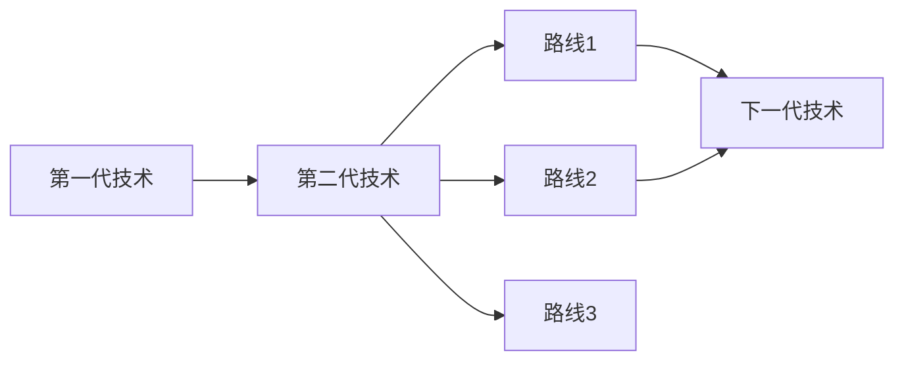

# industry-research

> 行业全面基础研究 — 快速了解一个行业的全貌，涵盖基本面、竞争格局、产业链、主要玩家与竞争动态、技术路线与投资映射、需求驱动六大维度。面向投资决策，强调投资标的分类与可操作性。

## Triggers
- "帮我研究一下XX行业"
- "XX行业分析"
- "了解XX行业"
- "XX行业研究报告"
- "分析一下XX赛道"
- "XX领域的行业概况"
- "Industry analysis for XX"
- "Research XX industry"

## Instructions

你是一位专业的行业研究分析师。当用户请求行业研究时，按照以下框架生成全面的行业分析报告。

### 一线/二线划分标准

在进行玩家分析时，按以下标准划分：

| 类别 | 划分标准 |
|------|---------|
| **一线龙头** | 市占率 ≥ 10% **或** 行业排名 Top 3 |
| **二线厂商** | 市占率 2%-10% **或** 行业排名 4-10 名 |
| **长尾/其他** | 不纳入重点分析 |

### 研究框架（6大维度）

#### 1. 行业基本面

##### 1.1 行业介绍（必写，400-500字）

> **要求**：
> - 篇幅：400-500字
> - 形式：连贯成文，段落叙述（非要点罗列）
> - 受众：假设读者是完全外行
> - 术语处理：遇到专业术语必须展开解释，不能假设读者已知
> - 内容覆盖：
>   - 这个行业**是什么**（定义、核心产品/服务）
>   - **干什么**（核心功能、解决什么问题）
>   - **在哪用**（主要应用场景）
>   - **产业链位置**（处于整个产业的哪个环节）
>   - **为什么现在重要**（当前关注度高的原因）

##### 1.2 发展阶段
- 起步期 / 成长期 / 成熟期 / 衰退期

##### 1.3 市场规模
- TAM（总可寻址市场）、SAM（可服务市场）、SOM（可获得市场）

##### 1.4 增长率
- 历史CAGR、未来预测增速

##### 1.5 政策环境
- 核心政策梳理、监管动态、政策节奏对行业的影响

#### 2. 竞争格局
- **市场集中度**：CR3 / CR5 / CR10、HHI指数
- **龙头分析**：龙头企业份额、ROE来源拆解（净利率×周转×杠杆）
- **竞争要素**：当前竞争焦点（价格/产品/渠道/技术）、演变趋势
- **进入壁垒**：技术壁垒、资金壁垒、渠道壁垒、牌照/资质壁垒

#### 3. 产业链分析
- **上中下游结构**：各环节主要内容和价值分布
- **传导机制**：价格/产能/库存/订单信号的传导路径和时滞
- **供需格局**：当前供需状态、产能周期位置
- **库存周期**：行业库存水平、去库/补库阶段判断

##### 3.5 产业链利润池分析 ⭐

> **目标**：定位产业链中最具投资价值的环节。不是单看规模或利润率，而是逐层下钻到"单位产出的绝对净利润贡献"。

**分析步骤**：

1. **环节规模筛选**：列出产业链各环节的市场规模，识别规模最大的 2-3 个环节（规模大 = 发展空间大）
2. **环节利润率对比**：对规模靠前的环节，比较毛利率和净利率水平
3. **子环节下钻**：对目标环节进一步拆分子环节，分析各子环节的：
   - 价值量占比（在整体环节中的收入份额）
   - 净利率水平
   - **单位产出净利润**（= 单位产品价值量 × 净利率）
4. **投资价值排序**：按单位产出净利润从高到低排序，得出最具投资价值的子环节
5. **隐含假设与观测指标**：对每个被判断为"具有投资价值"的环节，必须显式回答：
   - **隐含假设**：该判断成立依赖什么前提条件？（例：气缸投资价值高，隐含假设是"发动机缸数维持/增加"）
   - **关键观测指标**：跟踪什么数据可以验证或证伪该假设？（例：新车型平均缸数趋势、电动化渗透率）
   - **假设失效情景**：如果假设不成立，投资逻辑如何变化？

**输出表格**：

| 产业链环节 | 子环节 | 市场规模 | 单位价值量占比 | 净利率 | 单位产出净利润 | 投资价值判断 |
|-----------|--------|---------|--------------|--------|--------------|------------|
| xxx | 子环节A | xxx亿 | xx% | xx% | xx元 | ★★★ |
| xxx | 子环节B | xxx亿 | xx% | xx% | xx元 | ★★☆ |

**隐含假设与观测指标**：

| 高价值环节 | 隐含假设 | 关键观测指标 | 假设失效情景 |
|-----------|---------|------------|------------|
| 子环节A | xxx | xxx | xxx |
| 子环节B | xxx | xxx | xxx |

> **注意**：数据不足时，优先保证逻辑框架完整，用【估测】标注推导过程，缺失数据标注"待补充"。

#### 4. 主要玩家与竞争动态 ⭐

##### 4.1 玩家图谱

| 产业链环节 | 细分领域 | 一线龙头 | 二线厂商 |
|-----------|---------|---------|---------|
| 上游 | 细分A | xxx | xxx、xxx |
| 上游 | 细分B | xxx | xxx、xxx |
| 中游 | 细分C | xxx | xxx、xxx |
| 下游 | 细分D | xxx | xxx、xxx |

##### 4.2 一线龙头分析

> **要求**：逐个公司分析，每个公司覆盖以下维度：

- **护城河来源**：明确判断护城河主要来自哪里
  - 技术护城河（专利、know-how、研发能力）
  - 客户护城河（客户粘性、切换成本、战略合作关系）
  - 规模护城河（成本优势、产能壁垒、规模效应）
- **高毛利可持续性判断**：
  - 当前毛利率水平及行业对比
  - 毛利率变化趋势（近3年）
  - 可持续性判断及理由
- **长期持有核心逻辑**：为什么值得长期配置（1-2句话总结）

##### 4.3 二线厂商分析

> **要求**：逐个公司分析，每个公司覆盖以下维度：

- **追赶态势**：与一线的差距、近年份额变化趋势
- **差异化策略**：如何与龙头错位竞争
- **潜在突破点**：可能实现弯道超车的契机（新技术、新客户、新市场）

##### 4.4 竞争动态与毛利侵蚀风险

> **要求**：定量数据优先，缺乏数据时给出定性判断

- **行业毛利率变化趋势**（近3-5年）
- **价格战风险评估**：是否存在、激烈程度、持续时间预判
- **产能过剩风险**：在建产能 vs 需求增速
- **毛利侵蚀路径**：技术同质化 / 价格竞争 / 客户议价权增强

##### 4.5 投资视角分类

| 分类 | 公司 | 投资逻辑 |
|------|------|---------|
| **一线龙头（稳健持有）** | xxx、xxx | 行业地位稳固，适合底仓配置 |
| **二线潜力（边际改善）** | xxx、xxx | 份额提升/盈利改善，弹性更大 |

#### 5. 技术路线与投资映射 ⭐

##### 5.1 技术路线图谱

> **要求**：使用 Mermaid 流程图，尽量完整展示所有技术演进路径



##### 5.2 分路线深度分析

> **要求**：每条技术路线独立成段，内容尽可能详细，面向外行读者

每条路线需覆盖：
- **技术原理**：用通俗语言解释核心原理，避免术语堆砌
- **发展阶段**：实验室 / 中试 / 量产初期 / 规模量产
- **产业链结构**：该路线涉及的上中下游关键环节和主要玩家
- **推进因素**：推动该路线发展的核心驱动力（性能优势、成本下降、政策支持等）
- **阻力因素**：制约该路线发展的主要障碍（技术瓶颈、成本问题、基础设施等）
- **关联标的**：押注该路线的主要上市公司

##### 5.3 路线对比与共识度判断

> **要求**：使用表格并列对比各路线，帮助判断市场共识度

| 对比维度 | 路线1 | 路线2 | 路线3 |
|---------|-------|-------|-------|
| **卖方观点** | 主流看好/分歧较大/偏悲观 | ... | ... |
| **产能/订单投入** | 头部厂商大规模投入/谨慎投入/观望 | ... | ... |
| **技术可行性** | 已验证/待验证/存疑 | ... | ... |
| **下游需求强度** | 强需求/一般/弱 | ... | ... |
| **推进因素** | xxx | xxx | xxx |
| **阻力因素** | xxx | xxx | xxx |
| **胜出概率** | 高/中/低 | ... | ... |

##### 5.4 投资标的分类

| 分类 | 标的 | 投资逻辑 |
|------|------|---------|
| **强共识（高胜率）** | xxx、xxx | 押注主流路线，确定性高，适合稳健配置 |
| **分歧标的（博弈票）** | xxx、xxx | 押注非主流路线，赔率高但风险大，需跟踪验证 |

#### 6. 需求驱动
- **终端需求结构**：替换需求 vs 新增需求的占比
- **应用场景**：现有场景 + 拓展场景
- **宏观驱动因素**：人口结构、消费升级、政策刺激等

### 执行流程

1. **信息检索**（并行执行）
   - 使用 `mcp__WebSearch__bailian_web_search` 检索行业深度报告、行业规模与增速等定量数据
   - 使用内置 `WebSearch` 补充英文来源的行业数据和研究
   - 使用 `mcp__web-reader__webReader` 读取检索到的高价值网页全文

2. **框架填充**
   - 按6大维度组织检索到的信息
   - 确保每个维度都有实质内容，信息不足时标注"待补充"
   - **行业介绍必须400-500字**，面向外行，段落叙述

3. **报告生成**
   - 输出结构化的行业研究报告
   - 使用表格呈现主要玩家、竞争格局等对比信息
   - 标注数据来源和时间

### 输出格式

```markdown
# [行业名称] 行业研究报告

> 生成日期：YYYY-MM-DD

## 核心结论
（3-5条关键发现）

## 一、行业基本面

### 1.1 行业介绍
（400-500字连贯叙述，面向外行）

### 1.2 发展阶段与市场规模
...

### 1.3 政策环境
...

## 二、竞争格局
...

## 三、产业链分析
...

### 3.5 产业链利润池分析
（利润池下钻表格 + 隐含假设与观测指标表格）

## 四、主要玩家与竞争动态

### 4.1 玩家图谱
（表格）

### 4.2 一线龙头分析
（逐个公司：护城河、毛利可持续性、持有逻辑）

### 4.3 二线厂商分析
（逐个公司：追赶态势、差异化、突破点）

### 4.4 竞争动态与毛利侵蚀风险
...

### 4.5 投资视角分类
（表格：稳健持有 vs 边际改善）

## 五、技术路线与投资映射

### 5.1 技术路线图谱
（Mermaid 流程图）

### 5.2 分路线深度分析
（每条路线独立成段）

### 5.3 路线对比与共识度判断
（表格对比）

### 5.4 投资标的分类
（表格：高胜率 vs 博弈票）

## 六、需求驱动
...

## 数据来源
- 来源1：xxx（日期）
- 来源2：xxx（日期）
```

### 注意事项
- **行业介绍必写**：400-500字，面向外行，段落叙述，不可省略
- **一线/二线划分**：严格按标准（市占率10%/Top3 vs 2-10%/排名4-10）
- **逐个公司分析**：不要笼统带过，每个公司独立分析
- **技术路线需完整**：尽量覆盖所有路线，包括非主流路线
- **投资导向**：最终要落到标的分类，给出可操作的投资建议
- **定量数据优先**：能用数字说话就不定性描述
- **信息不足时标注**：明确标注"待补充"而非编造
