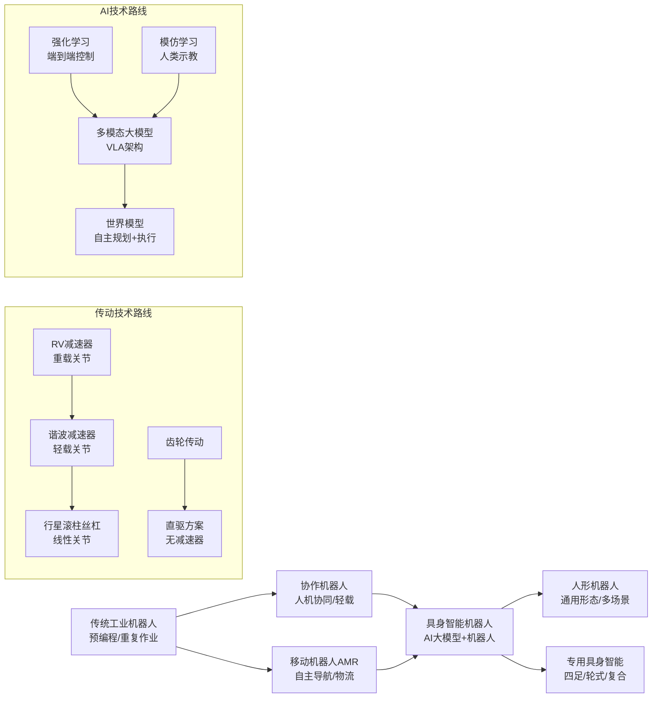

# 机器人行业研究报告

> 生成日期：2026-03-20

## 核心结论

1. **全球机器人市场已突破1,200亿美元，中国以54%的工业机器人安装量稳居全球第一**。2025年中国工业机器人产量77.3万套（+28% YoY），且首次成为工业机器人净出口国，国产品牌份额升至57%，埃斯顿首超发那科成为中国市场第一。【来源：IFR《世界机器人报告2025》、国家统计局】

2. **人形机器人从"技术验证"进入"小批量量产元年"**，2025年全球出货约1.4~1.8万台（+500%以上），中国厂商占据全球出货量前六席位，合计份额超74%。宇树科技、智元机器人以5,000+台级出货量领跑全球。集邦咨询预判2026年全球出货将突破5万台（+700%）。【来源：IDC、赛迪报告、集邦咨询】

3. **产业链利润池分析揭示：核心零部件（减速器、伺服、丝杠）是价值量最高的投资环节**。核心零部件环节平均毛利率22.5%、净利率9.3%，远高于本体制造和系统集成；其中谐波减速器龙头绿的谐波毛利率36.6%，是整条产业链最具投资价值的子环节。国产替代空间巨大——精密减速器国产化率不足30%，高端伺服不足40%。【来源：国金证券三季报总结、绿的谐波三季报】

4. **"十五五"规划将机器人列为战略性新兴产业**，工信部明确国家AI产业投资基金加大对人形机器人支持力度，国内整机企业超140家，产品超330款。政策从"技术攻关"升级到"规模化应用+标准体系构建"。【来源：工信部政策、"十五五"规划纲要】

5. **需求驱动三重叠加**：劳动力短缺（中国制造业青年劳动力缺口预计2030年突破3,000万）+ 制造业智能化升级（机器人密度目标翻番至500台/万人）+ AI具身智能技术突破（大模型赋能机器人认知决策），三条主线共同打开长期增长天花板。

## 一、行业基本面

### 1.1 行业介绍

机器人是一类能够通过编程和自动控制来执行作业或移动等任务的机器，其核心能力包括环境感知（通过激光雷达、视觉传感器等）、认知决策（基于控制算法或AI大模型的路径规划与任务分解）以及物理执行（通过机械臂、移动底盘、灵巧手等机构完成操作）。简单来说，机器人就是能"看懂环境、想好方案、动手干活"的智能机器。

按用途划分，机器人主要分为三大类：工业机器人、服务机器人和特种机器人。工业机器人是最成熟的品类，常见于汽车焊装线、电子产品装配线、物流仓库等场景，承担搬运、焊接、喷涂、装配等重复性高、精度要求严的工作。服务机器人面向人类生活和商业场景，包括扫地机器人、送餐机器人、手术机器人、康养陪护机器人等，2024年全球服务机器人在智能机器人市场中占比已达61.8%。特种机器人则用于军事、应急救援、深海勘探等极端环境。近两年最受关注的新品类是人形机器人（humanoid robot），它模仿人类双足行走和双手操作的形态，目标是在为人类设计的环境中直接替代人类劳动。

在产业链中，机器人处于先进制造的中游位置——上游依赖减速器、伺服电机、控制器等核心零部件（合计占整机成本约70-80%），下游通过系统集成商连接到汽车、电子、新能源、医疗、物流等终端应用场景。

机器人行业当前之所以备受关注，有三重原因：一是全球人口老龄化和劳动力短缺倒逼制造业加速自动化；二是AI大模型技术突破使机器人从"预编程执行"跨越到"自主理解与决策"，所谓"具身智能"概念成为现实；三是人形机器人在2025年正式进入量产元年，以特斯拉Optimus、宇树科技、智元机器人为代表的企业开始批量交付，产业从概念验证走向商业化，被视为继新能源汽车之后高端制造领域最具颠覆性的新赛道。

### 1.2 发展阶段与市场规模

**发展阶段判断**：机器人行业整体处于**成长期**，但内部分化显著。工业机器人已进入成熟成长阶段（全球安装量连续四年超50万台，增速放缓至个位数）；服务机器人处于快速成长期（医疗机器人+91%、教育机器人+40%）；人形机器人处于起步期向成长期过渡的拐点（2025年全球出货约1.4-1.8万台，同比+500%以上，但绝对量仍小）。

**全球市场规模**（2025年，来源：IFR/IDC/多机构共识区间）：

| 细分领域 | 全球规模（美元） | 增速 | 备注 |
|---------|----------------|------|------|
| 机器人行业整体 | 约1,100-1,200亿 | +12-15% | 含本体+零部件+集成+软件 |
| 工业机器人 | 230-250亿 | +6% | 本体+系统集成，安装量57.5万台 |
| 服务机器人 | 700-710亿 | +50%（中国） | 消费级占比高 |
| 特种机器人 | 130-135亿 | +16% | 政策驱动 |
| 人形机器人 | 约4.4-5亿 | +500%+ | 出货1.4-1.8万台 |

**中国市场规模**（2025年，来源：中商产业研究院/IFR/赛迪）：

| 细分领域 | 中国规模 | 同比增速 |
|---------|---------|---------|
| 工业机器人 | 约1,260-1,270亿元 | +23.2% |
| 服务机器人 | 约1,150亿元 | +35% |
| 特种机器人 | 约300亿元 | +16.8% |
| 工业机器人产量 | 77.3万套 | +28.0% |
| 工业机器人安装量 | 29.5万台（全球54%） | +7% |

**关键增长指标**：
- 全球工业机器人在役总量：466.4万台（2024年，+9% YoY）【来源：IFR 2025报告】
- IFR预测2028年全球工业机器人安装量将突破70万台（CAGR约7%）
- 中国工业机器人出口2025年同比增长超48%，首次成为净出口国【来源：海关总署】
- 2025年前8个月中国机器人领域一级市场融资额达386.24亿元，是2024全年的1.8倍

### 1.3 政策环境

中国对机器人行业的政策支持从"十二五"至今持续升级，主线从基础研发逐步升级为全产业链赋能和规模化应用：

**国家级核心政策**：
- **"十五五"规划纲要（2026年）**：将机器人明确列为战略性新兴产业，与AI、新能源汽车并列。强调加快发展，并将具身智能定位为"未来产业"。【来源：新华社/"十五五"规划纲要】
- **《人形机器人创新发展指导意见》（2023年10月，工信部）**：中国首个国家级、系统性人形机器人产业政策，明确2025年实现整机产品量产、2027年形成安全可靠产业链、构建具有国际竞争力的产业生态。
- **工信部2026年工作部署**：明确国家AI产业投资基金加大对人形机器人支持力度，建设开源社区，发布综合标准化体系建设指南。截至2025年底，国内整机企业超140家，已发布产品超330款。【来源：工信部官网】
- **"十四五"智能制造发展规划**：制造业机器人密度目标翻番，2025年达500台/万人（2020年约246台/万人），关键工序数控化率达68%。

**地方政策**：截至2025年12月，国内多省市已出台人形机器人专项政策，东部沿海省市以千亿级产业集群为目标，中西部侧重补链强链。北京、上海、深圳形成三大人形机器人产业高地。

**政策节奏对行业的影响**：政策正从"鼓励研发"快速切换到"鼓励量产+规范标准"阶段。国家AI产业投资基金的注入、各地产业园区建设、以及宇树科技IPO等事件，意味着资本和政策同步加码，产业化加速进入正循环。

## 二、竞争格局

**市场集中度**：

| 细分领域 | CR3 | CR5 | 格局特征 |
|---------|-----|-----|---------|
| 全球工业机器人 | ~35%（四大家族占~50%） | ~55% | 寡头竞争，国产替代加速 |
| 中国工业机器人 | ~25%（埃斯顿+汇川+发那科） | ~40% | 2025年国产份额升至57% |
| 全球人形机器人 | 61.8% | 73.6% | 高度集中，中国厂商包揽前六 |
| 全球协作机器人 | ~30% | 46.3%（优傲+越疆+遨博等） | 中度集中，中国份额扩大 |
| 智能物流机器人 | ~8% | 12.6% | 极度分散 |

**龙头分析**：

工业机器人领域，全球"四大家族"——发那科（日本，2025营收72亿美元）、ABB（瑞士，68亿美元）、安川电机（日本，45亿美元）、库卡（德国/美的，44亿美元）——长期垄断高端市场，合计全球份额约50%。但2025年出现历史性拐点：中国本土品牌在国内市场份额首次升至57%，其中**埃斯顿首次超越发那科成为中国市场销量第一**。国产替代的核心驱动力来自性价比优势（国产方案较进口降本约35%）和本土化服务响应速度。【来源：虎嗅、IFR 2025报告】

人形机器人领域竞争格局更为清晰：CR3达61.8%，中国企业包揽全球出货量前六。宇树科技（32.4%份额，出货超5,500台）和智元机器人（23.5%份额，出货超5,000台）合计占据全球超55%。反观海外，特斯拉Optimus全年仅交付约150台，Figure AI同量级，量产进度远落后于中国厂商。【来源：赛迪报告、IDC、Counterpoint】

**竞争要素**：当前竞争焦点已从"能不能做出来"转向"谁能量产得更快、更便宜"。核心竞争要素依次为：量产制造能力 > 成本控制 > AI算法（具身智能）> 场景落地速度。

**进入壁垒**：
- **技术壁垒**：核心零部件（减速器、伺服）技术门槛极高，精密减速器国产化率不足30%，高端RV减速器国产化率不足15%
- **资金壁垒**：人形机器人从研发到量产需大量资金，Figure AI估值已达390亿美元，宇树科技IPO募资42亿元
- **供应链壁垒**：整机厂商需深度绑定核心零部件供应商，关系建立周期长
- **场景壁垒**：下游汽车、电子等行业对机器人稳定性要求极高，需多年现场验证

## 三、产业链分析

**上中下游结构**：

| 环节 | 主要内容 | 成本占比 | 代表企业 |
|------|---------|---------|---------|
| **上游：核心零部件** | 减速器（RV/谐波） | 30-35% | 绿的谐波、双环传动、中大力德、纳博特斯克（日） |
| | 伺服系统（电机+驱动器） | 20-25% | 汇川技术、禾川科技、安川（日）、松下（日） |
| | 控制器 | 10-15% | 埃斯顿、固高科技、发那科（日） |
| | 传感器/丝杠/轴承 | 5-10% | 新剑传动、长盛轴承、南京工艺 |
| **中游：本体制造** | 工业机器人整机 | 20-30% | 埃斯顿、汇川技术、发那科、ABB |
| | 人形机器人整机 | — | 宇树科技、智元机器人、优必选、特斯拉 |
| **下游：系统集成+应用** | 系统集成方案 | — | 新松机器人、拓斯达、博实股份 |
| | 终端应用 | — | 汽车（35%）、电子（28%）、物流（15%）、医疗（12%） |

**传导机制**：产业链传导路径为"下游需求→整机订单→零部件采购→上游产能"，传导时滞约1-2个季度。当前最强的需求信号来自两条线：一是传统工业机器人在汽车+电子+半导体+锂电的稳健需求；二是人形机器人量产启动带来的零部件爆发式增量（单台人形机器人需12-20个减速器、30-50个关节、数百颗GaN功率器件）。

**供需格局**：工业机器人整体供需偏紧平衡，2024年国内产能利用率约65%，结构性过剩问题存在（低端搬运机器人过剩、高端焊接/协作机器人偏紧）。核心零部件环节供需格局最好——精密减速器国产化率不足30%，高端伺服不足40%，存在明确的供给缺口和国产替代窗口。

**库存周期**：2024年行业经历了一轮去库存，2025Q1行业库存周转效率开始改善，25Q3净利率出现拐点（8.32%，同比+0.94pct）。行业整体处于去库尾声向补库初期过渡阶段。【来源：国金证券机器人三季报总结】

### 3.5 产业链利润池分析

> **目标**：定位产业链中最具投资价值的环节。不是单看规模或利润率，而是逐层下钻到"单位产出的绝对净利润贡献"。

**第一步：环节规模筛选**

| 产业链环节 | 市场规模（中国，2025年） | 备注 |
|-----------|----------------------|------|
| 减速器（含所有类型） | ~1,510-1,520亿元 | 机器人用仅为其中一部分，来源：中商产业研究院 |
| 伺服电机 | ~245-250亿元 | 机器人用占比约38%，来源：中商产业研究院 |
| 控制器 | 规模较小，快速增长 | 2024全球销量3.1万台→2025年预计5.29万台 |
| 工业机器人本体 | ~1,260亿元（整体） | 含集成，来源：IFR/多机构 |
| 系统集成 | 汽车集成258亿+3C集成328亿（2023年） | 来源：同花顺 |

规模最大的两个环节：**核心零部件**（减速器+伺服+控制器合计）和**本体+集成**。

**第二步：环节利润率对比**

机器人板块122家上市公司2025年前三季度财务数据【来源：国金证券】：

| 环节 | 平均毛利率 | 平均净利率 | 特征 |
|------|----------|----------|------|
| **核心零部件** | 22.54% | **9.33%** | 利润率最高，技术壁垒最强 |
| 本体及总成 | ~21%（改善中） | ~3-5% | 降本效果显现，但净利仍薄 |
| 设备/集成 | ~20% | ~7%（25Q3大幅改善） | 波动大，费用率最高 |
| 行业整体 | 21.97% | 7.91% | — |

**第三步：子环节下钻**

对利润率最高的核心零部件环节，进一步拆分：

| 子环节 | 代表公司 | 毛利率 | 净利率 | 单台机器人价值量 | 备注 |
|--------|---------|--------|--------|----------------|------|
| **谐波减速器** | 绿的谐波 | **36.6%** | ~22%（2025全年净利率） | 占整机成本8-12% | 技术壁垒最高，国产替代空间最大 |
| RV减速器 | 双环传动 | ~25-28% | ~8-12% | 占整机成本10-15% | 重载关节核心，国产化率<15% |
| 伺服系统 | 汇川技术（机器人业务） | ~29% | ~13%（集团整体） | 占整机成本20-25% | 规模效应强，国产渗透率提升中 |
| 行星滚柱丝杠 | 新剑传动等 | 【估测】30-40% | 【估测】15-20% | 人形机器人新增刚需 | 国产化率仅19%，蓝海 |
| 控制器 | 固高科技等 | ~30% | ~10-15% | 占整机成本10-15% | 国产化率相对较高 |
| 本体制造 | 埃斯顿 | 28.5% | **<1%** | — | 营收第一但净利极薄 |
| 系统集成 | 新松机器人 | **10-15%** | **~2-5%** | — | 重资产、低壁垒、苦生意 |

**第四步：投资价值排序**

| 产业链环节 | 子环节 | 市场规模 | 单位价值量占比 | 净利率 | 单位产出净利润 | 投资价值判断 |
|-----------|--------|---------|--------------|--------|--------------|------------|
| 核心零部件 | 谐波减速器 | ~50亿元（机器人用）【估测】 | 8-12% | ~22% | 高 | ★★★ |
| 核心零部件 | 行星滚柱丝杠 | ~30亿元（2028年预测） | 人形机器人新增 | 【估测】15-20% | 高（蓝海溢价） | ★★★ |
| 核心零部件 | 伺服系统 | ~95亿元（机器人用）【估测】 | 20-25% | ~13% | 中高 | ★★☆ |
| 核心零部件 | RV减速器 | ~60亿元（机器人用）【估测】 | 10-15% | ~10% | 中 | ★★☆ |
| 中游 | 本体制造 | ~500亿元 | 20-30% | <1-3% | 低 | ★☆☆ |
| 下游 | 系统集成 | ~600亿元 | — | 2-5% | 低 | ★☆☆ |

> 注：机器人用减速器/伺服的细分规模为估测值，推导依据：总市场规模 × 机器人应用占比（减速器约3-4%，伺服约38%）。

**第五步：隐含假设与观测指标**

| 高价值环节 | 隐含假设 | 关键观测指标 | 假设失效情景 |
|-----------|---------|------------|------------|
| 谐波减速器 | 协作机器人+人形机器人持续放量，轻载关节需求指数级增长 | 绿的谐波季度出货量、人形机器人整机出货量、协作机器人渗透率 | 人形机器人量产不及预期，或直驱方案替代谐波减速器 |
| 行星滚柱丝杠 | 人形机器人线性关节成为标配，特斯拉Optimus持续迭代量产 | 特斯拉Optimus交付量、国内人形机器人厂商丝杠采购订单 | 人形机器人转向其他传动方案（如液压驱动），或量产大幅延后 |
| 伺服系统 | 国产替代持续推进，汇川等厂商从中低端向高端渗透 | 国产伺服在3C/汽车行业渗透率、汇川机器人业务营收增速 | 日系品牌大幅降价阻击，国产高端突破受阻 |
| RV减速器 | 重载工业机器人需求稳健增长，国产化率从<15%持续提升 | 双环传动/中大力德RV产品出货量、进入头部整机厂供应链进度 | 工业机器人增速大幅放缓，或轻量化趋势减少RV需求 |

> **注意**：数据不足时，优先保证逻辑框架完整，用【估测】标注推导过程，缺失数据标注"待补充"。

## 四、主要玩家与竞争动态

### 4.1 玩家图谱

| 产业链环节 | 细分领域 | 一线龙头 | 二线厂商 |
|-----------|---------|---------|---------|
| 上游 | 谐波减速器 | 绿的谐波、哈默纳科（日本HD） | 来福谐波、大族精密 |
| 上游 | RV减速器 | 纳博特斯克（日）、双环传动 | 中大力德、秦川机床 |
| 上游 | 伺服系统 | 汇川技术、安川（日）、松下（日） | 禾川科技、信捷电气 |
| 上游 | 控制器/算力 | 发那科（日）、固高科技 | 寒武纪、海光信息、中科创达 |
| 上游 | 行星滚柱丝杠 | Rollvis（瑞士）、新剑传动 | 南京工艺、恒立液压、北特科技 |
| 上游 | 传感器/轴承 | 长盛轴承（宇树独家） | 五洲新春 |
| 中游 | 工业机器人整机 | 发那科、ABB、**埃斯顿** | 汇川技术、新松机器人、拓斯达 |
| 中游 | 人形机器人整机 | **宇树科技、智元机器人**、优必选 | 乐聚、加速进化、松延动力、傅利叶 |
| 中游 | 协作机器人 | 优傲（丹麦）、越疆机器人 | 遨博智能、大象机器人 |
| 下游 | 系统集成 | 新松机器人、博实股份、拓斯达 | 埃夫特、巨一科技 |

### 4.2 一线龙头分析

**埃斯顿（002747.SZ / 拟港股上市）— 中国工业机器人第一**

- **护城河来源**：技术护城河+规模护城河。埃斯顿是国内少数同时掌握伺服系统、控制器、整机的全产业链企业，核心零部件自主率高。2025年前三季度营收38亿元（行业第一），海外收入占比超30%，已进入全球汽车零部件企业供应商名录。
- **高毛利可持续性**：毛利率28.5%（2025Q3），高于行业平均25.2%，但呈缓慢下滑趋势（2022年32.9%→2025年28.2%）。海外业务毛利率维持30%以上，是利润的关键支撑。可持续性取决于海外扩张进度和产品高端化。
- **长期持有逻辑**：国产工业机器人龙头，受益于国产替代的长期趋势，目标"从中国第一迈向全球前三"。但需关注负债率偏高（80.5%）和净利率极薄（<1%）的风险。

**汇川技术（300124.SZ）— 伺服系统+工业机器人双轮驱动**

- **护城河来源**：规模护城河+技术护城河。国内伺服系统龙头，核心零部件80%自研，SCARA机器人市占率领先。2025年前三季度整体营收316.6亿元（+24.7%），归母净利润42.5亿元（+26.8%）。
- **高毛利可持续性**：集团毛利率29.3%，净利率约13%。机器人业务虽单独毛利较低，但受益于伺服+控制器内供的垂直整合优势，综合盈利能力远强于纯整机厂商。
- **长期持有逻辑**：伺服国产替代的最大受益者，在3C行业渗透率已突破28%。机器人+伺服双轮驱动，确定性高。

**绿的谐波（688017.SH）— 谐波减速器国产替代旗手**

- **护城河来源**：技术护城河。打破日本HD长期垄断，凭借齿形设计与材料处理工艺实现国产替代，产品良率提升至95%以上，是目前全球少数具备规模化量产能力的谐波减速器厂商。
- **高毛利可持续性**：毛利率36.6%（2025Q3），是机器人板块最高水平。但较上年同期下降2.93pct，反映行业竞争加剧。2025年全年营收5.69亿（+46.9%），净利润1.25亿（+122.4%），增长弹性极强。
- **长期持有逻辑**：协作机器人+人形机器人双重增量驱动，谐波减速器是人形机器人旋转关节的核心部件，绿的谐波作为国内龙头直接受益于人形机器人量产放量。

**宇树科技（拟科创板上市）— 人形机器人全球出货量第一**

- **护城河来源**：技术护城河（运动控制算法领先）+成本护城河（极致性价比，G1起售价2.99万元）。2025年春晚《武BOT》表演一夜成名，全年出货超5,500台，全球市占率32.4%。
- **高毛利可持续性**：尚未上市，财务数据未公开披露。但其入门级R1售价仅5,900美元（远低于海外同类），说明成本控制能力极强，量产后规模效应有望支撑合理毛利率。
- **长期持有逻辑**：运动控制算法+极致性价比双重优势，已完成IPO辅导（募资42亿），2026年目标出货1-2万台。关注上市后估值与业绩兑现节奏。

**智元机器人 AgiBot（拟上市）— 人形机器人商业化营收全球第一**

- **护城河来源**：客户护城河+技术护城河。2025年销售额超1.4亿美元（Counterpoint口径），全球营收第一。产品矩阵丰富，开源策略快速切入酒店、娱乐、工业物流等多场景。上海工厂已下线超5,000台。
- **长期持有逻辑**：商业化落地速度最快的人形机器人厂商，多场景覆盖降低单一市场风险。

### 4.3 二线厂商分析

**优必选（09880.HK）— "人形机器人第一股"**

- **追赶态势**：累计2,450+项人形机器人专利，Walker S2工业人形机器人已下线第1,000台，2025年全年人形机器人订单金额接近14亿元。市场份额约3.5-5%，低于宇树和智元。
- **差异化策略**：全栈式技术积累（自研ROSA 2.0操作系统），通过收购锋龙股份向上游零部件延伸，强化供应链控制力。2026年产能目标万台级。
- **潜在突破点**：已是港股上市公司，资本优势明显；工业场景深耕经验丰富（Walker系列在汽车工厂实训）。

**乐聚机器人 — 华为云战略合作**

- **追赶态势**：2025年出货约1,000台，全球份额5.9%。
- **差异化策略**：与华为云战略合作，KUAVO系列接入华为云端训练能力，形成"云-端"协同优势。
- **潜在突破点**：华为生态加持可能在政企和教育市场快速放量。

**松延动力 — C端消费级先行者**

- **追赶态势**：2025年出货约1,000台，2026年春晚小品中展示仿生人脸+后空翻+情绪交互能力。
- **差异化策略**：精准定位C端消费市场，终端售价逐步降至3万元级，覆盖老年陪伴等刚需场景。
- **潜在突破点**：C端市场一旦打开（预计2027年后），先发优势显著。

**越疆机器人 — 全球协作机器人龙头**

- **追赶态势**：全球首家拥有0.25-20kg负载产品矩阵的协作机器人企业，截至2024年全球累计出货8万台，销往80+国家。
- **差异化策略**：产品矩阵最全（七大系列20余款），覆盖3C、汽车、半导体、医疗等15+行业。
- **潜在突破点**：具身智能商业化，协作机器人向人形机器人技术延伸。

### 4.4 竞争动态与毛利侵蚀风险

**行业毛利率变化趋势**：2024年机器人板块整体毛利率21.7%（同比-0.23pct），2025Q1回升至23.6%（+0.82pct），25Q3维持21.9%（+0.39pct）。整体呈现企稳回升态势，但分化明显——零部件环节毛利坚挺，整机和集成环节承压。【来源：国金证券、同花顺】

**价格战风险评估**：工业机器人领域价格竞争持续升温。2025年前三季度"内外资品牌竞争持续升温，部分机型价格接近底部"。以打磨机器人为例，单价从2017年65万元降至2024年45万元，预计2028年进一步降至35万元。协作机器人价格战更为激烈。人形机器人目前处于"抢市场份额"阶段，中国厂商已推出低于1,600美元的入门级产品，短期不以利润为导向。【来源：MIR DATABANK、界面新闻】

**产能过剩风险**：工业机器人2024年产能利用率仅65%，结构性过剩问题突出（低端过剩、高端不足）。人形机器人目前产能远不足，但2026年集邦预判出货5万台（+700%），供给端超150家企业涌入，2-3年内可能出现阶段性过剩。

**毛利侵蚀路径**：
1. **工业机器人**：技术同质化→价格竞争→毛利率持续下滑，龙头通过海外高毛利市场+高端化对冲
2. **人形机器人**：当前处于"跑马圈地"阶段，利润不是焦点；2027年后进入淘汰赛，无法量产降本的企业将被出清
3. **核心零部件**：受国产替代红利保护，短期毛利坚挺；中期随着国产厂商增多、日系降价反击，毛利率面临个位数级别的缓慢下滑

### 4.5 投资视角分类

| 分类 | 公司 | 投资逻辑 |
|------|------|---------|
| **一线龙头（稳健持有）** | 汇川技术、绿的谐波 | 伺服/减速器核心赛道龙头，国产替代确定性最高，盈利能力行业最优，适合底仓配置 |
| **一线龙头（关注盈利拐点）** | 埃斯顿 | 中国工业机器人第一，营收大但净利极薄，关注港股上市后融资+海外扩张能否改善盈利 |
| **人形机器人龙头（高弹性）** | 宇树科技（待上市）、智元机器人（待上市） | 全球出货量/营收第一梯队，但尚未上市，估值不确定性大，适合事件驱动型配置 |
| **二线潜力（边际改善）** | 优必选、越疆机器人、双环传动 | 各自细分赛道份额提升中，弹性大于龙头，但确定性略低 |
| **零部件隐形冠军（高赔率）** | 长盛轴承、新剑传动、中大力德 | 深度绑定人形机器人整机厂商，订单随量产爆发，但市值小、流动性风险需关注 |

## 五、技术路线与投资映射

### 5.1 技术路线图谱

### 5.2 分路线深度分析

**路线一：传统工业机器人→高端化+智能化**

工业机器人已有60年历史（1961年第一台Unimate诞生于美国），技术原理是通过多关节机械臂按预设程序重复执行焊接、搬运、装配等标准化动作。当前处于规模量产成熟期，全球年安装量稳定在50万台以上。产业链上游由日德企业主导（减速器的纳博特斯克、伺服的安川），中游整机"四大家族"占据约50%全球份额。推进因素是制造业自动化的刚性需求（汽车+电子+新能源）以及国产替代加速。阻力因素是价格战激烈、低端产能过剩、高端核心零部件仍依赖进口。关联标的：埃斯顿、汇川技术、新松机器人、拓斯达。

**路线二：协作机器人 — 人机共存的过渡形态**

协作机器人（Cobot）是指能够与人类在同一空间安全协作的轻型机器人，不需要安全围栏，典型负载0.25-20kg。核心技术原理是力矩传感器实时感知碰撞力并紧急停止。目前处于快速成长期，2025年前三季度仍保持两位数增长，是工业机器人中增速最快的细分。产业链结构与传统工业机器人类似，但更依赖谐波减速器（轻载）而非RV减速器。推进因素：中小企业自动化需求（柔性产线）、人工成本上涨。阻力因素：负载受限、速度较慢、部分场景被人形机器人替代。关联标的：越疆机器人、遨博智能、大象机器人。全球CR5为46.3%，中国企业占四席。

**路线三：人形机器人 — "终极形态"之争**

人形机器人模仿人类双足行走+双手操作的形态设计，核心是要在为人类设计的环境（工厂、家庭、商业空间）中直接替代人类劳动。技术栈包括：运动控制（关节驱动+平衡控制）、环境感知（视觉/激光雷达/力觉）、AI决策（大模型驱动的任务理解和规划）。2025年正式进入小批量量产元年，全球出货约1.4-1.8万台。产业链上游核心增量部件是谐波减速器、行星滚柱丝杠、无框电机、灵巧手、GaN功率器件等，单台用量远超传统工业机器人。推进因素：劳动力短缺倒逼+AI技术突破+特斯拉/中国厂商竞赛催化+政策强力支持。阻力因素：可靠性不足（故障率需从"每月几次"降到"每年几次"）、成本仍高（均价约15.8万美元）、应用场景尚需验证。关联标的：宇树科技、智元机器人、优必选、特斯拉（TSLA）、Figure AI、绿的谐波、长盛轴承。

**路线四：具身智能（AI+机器人融合）— 底层技术范式**

具身智能不是某种具体硬件形态，而是一种技术范式——让机器人通过感知、决策和执行的闭环与物理世界交互，而非仅执行预设指令。核心技术原理是多模态大模型（VLA架构：Vision-Language-Action）将视觉输入和语言指令转化为机器人动作。目前处于从实验室向产业化过渡阶段，2025年国内外多家企业已在工厂、仓库中部署具身智能系统。推进因素：大模型能力快速提升、数据采集与预训练工厂建设加速。阻力因素：训练数据稀缺（机器人领域远不如自动驾驶）、Sim-to-Real迁移困难、算力成本高。关联标的：中科创达（机器人操作系统）、寒武纪（边缘AI芯片）、海光信息（DCU算力）。

**路线五：直驱方案 vs 减速器方案 — 传动技术分歧**

传统机器人关节采用"电机+减速器"方案，通过减速器将电机高转速/低扭矩转换为低转速/高扭矩。直驱方案则取消减速器，用高扭矩密度电机直接驱动关节，优点是响应快、结构简单、无背隙，缺点是对电机性能要求极高、功耗大。目前主流仍是减速器方案（谐波+RV），但部分人形机器人的手指、手腕等低负载关节开始尝试直驱或准直驱。这条路线的分歧直接影响减速器厂商的长期天花板。关联标的：绿的谐波（减速器方案受益）、步科股份（直驱方案受益）。

### 5.3 路线对比与共识度判断

| 对比维度 | 传统工业机器人 | 协作机器人 | 人形机器人 | 具身智能（AI） |
|---------|-------------|----------|----------|------------|
| **卖方观点** | 稳健增长共识 | 看好，但关注价格战 | 极度看好，分歧在节奏 | 长期主线共识 |
| **产能/订单投入** | 头部厂商稳定投入 | 持续扩产 | 激进扩产（150+家企业涌入） | 头部科技公司重金投入 |
| **技术可行性** | 已验证 | 已验证 | 量产已验证，可靠性待提升 | 关键突破中，尚未完全验证 |
| **下游需求强度** | 强（汽车/电子/新能源） | 中强（中小企业柔性需求） | 强预期，实际需求待兑现 | 强需求但落地周期长 |
| **推进因素** | 制造业刚需+国产替代 | 人工成本+柔性产线 | 劳动力短缺+AI突破+政策 | 大模型能力提升 |
| **阻力因素** | 价格战+低端过剩 | 负载限制+人形替代 | 可靠性+成本+场景验证 | 数据稀缺+Sim-to-Real |
| **胜出概率** | 高（基本盘稳固） | 中高（过渡形态） | 高（长期终极形态） | 高（底层范式） |
| **投资时间窗口** | 当下（已兑现） | 当下（增速放缓中） | 2025-2028（量产爬坡期） | 2026-2030（渐进兑现） |

### 5.4 投资标的分类

| 分类 | 标的 | 投资逻辑 |
|------|------|---------|
| **强共识（高胜率）** | 汇川技术、绿的谐波、双环传动 | 押注核心零部件国产替代+人形机器人放量，确定性高，适合稳健配置 |
| **强共识（人形龙头）** | 宇树科技（待上市）、智元机器人（待上市）、优必选 | 押注人形机器人量产主线，高弹性高波动，需关注估值锚 |
| **分歧标的（博弈票）** | 长盛轴承、新剑传动、中大力德 | 深度绑定特定整机厂商（如宇树），订单爆发弹性大，但客户集中度风险高 |
| **AI+机器人交叉（长线）** | 中科创达、寒武纪 | 押注具身智能底层算力和操作系统，兑现周期较长但天花板高 |
| **特斯拉链（海外）** | 特斯拉（TSLA）、三花智控、拓普集团 | 押注Optimus量产，供应链确定性随特斯拉产能规划而定，2026下半年是关键验证窗口 |

## 六、需求驱动

**终端需求结构**：

当前机器人行业的需求可以拆分为三层：

1. **存量替换需求（约60%）**：现有工业机器人的更新换代（平均使用寿命8-12年），以及传统人工岗位向机器人的持续替代。主要驱动力是劳动力成本上升和制造业效率竞争。中国制造业机器人密度2024年约400台/万人，"十四五"目标500台/万人，对标韩国（约1,000台/万人）仍有翻倍空间。

2. **新增需求——新场景渗透（约30%）**：机器人从传统的汽车、电子行业向半导体、锂电、光伏、医疗、物流仓储等新场景加速渗透。2025年前三季度，半导体和锂电行业的工业机器人订单增长尤为突出。服务机器人领域，医疗机器人（+91%）和教育机器人（+40%）是增速最快的新场景。【来源：MIR DATABANK、IFR】

3. **全新增量需求——人形机器人（约10%，快速增长中）**：人形机器人开辟了全新的需求维度，当前以文娱商演（26%）、数据采集（22%）、工业智造（17%）、导览导购（15%）为主要落地场景。预计2027年后快速切入零售服务和家庭陪伴等大众场景，市场空间呈指数级扩容。到2035年，Omdia预测全球人形机器人出货量有望达260万台。【来源：Counterpoint、Omdia】

**宏观驱动因素**：

- **人口结构**：全球制造业面临结构性"用工荒"。日本65岁以上老年人劳动参与率已达25%，中国制造业青年劳动力缺口预计2030年突破3,000万。这不是周期性波动，而是长期不可逆的趋势，机器人是目前唯一可规模化的解决方案。

- **制造业升级**：中国"十五五"规划明确推进智能制造，累计已建成3.5万余家智能工厂。机器人密度提升是制造业升级的核心指标，政策目标+企业降本双重驱动。

- **AI技术突破**：大模型赋能机器人认知决策能力，使机器人从"执行预设指令的工具"向"能理解环境、自主决策的智能体"跨越。这一变化从根本上打开了机器人的应用边界——不再局限于标准化重复工作，而是能处理非结构化、不确定性高的真实场景。

- **成本下降**：核心零部件国产替代驱动成本持续下降。以打磨机器人为例，十年间单价降幅达46%（65万→35万元）。人形机器人领域，中国厂商已将整机售价压至3万元级，远低于海外同类产品。当单台机器人成本降至"年薪等值"以下（投资回收期<1.5年），渗透率将进入加速期。

**关键拐点信号**：
- 工业机器人：关注季度安装量增速能否从个位数回升到双位数（当前+7%）
- 人形机器人：关注2026年出货能否达到集邦预判的5万台（验证量产能力）
- 具身智能：关注头部企业的Sim-to-Real迁移成功率和实际部署后的ROI数据

## 数据来源

- IFR《世界机器人报告2025》（2025年9月发布）
- IDC 2025年全球人形机器人出货数据（2026年2月发布）
- 赛迪《2025年人形机器人市场研究报告》（中国电子报，2026年3月发布）
- Counterpoint 2025年全球人形机器人销售额数据（2026年3月发布）
- Omdia《通用具身机器人市场雷达》报告
- 集邦咨询（TrendForce）人形机器人出货量预测
- 国家统计局：2025年工业机器人产量数据（2026年1月发布）
- 海关总署：2025年工业机器人进出口数据
- 工信部：人形机器人产业政策及行业数据（2026年1月发布）
- "十五五"规划纲要（2026年3月发布）
- MIR DATABANK：2025年中国工业机器人季度销量及下游数据
- 中商产业研究院：减速器、伺服电机市场规模数据
- 国金证券：机器人行业2025年三季报总结（陈传红团队）
- 同花顺：机器人板块财务数据汇总
- 各上市公司财报/业绩快报：绿的谐波、汇川技术、埃斯顿等
- 详细引用链接见同目录下 `机器人行业研究_引用链接.md`
