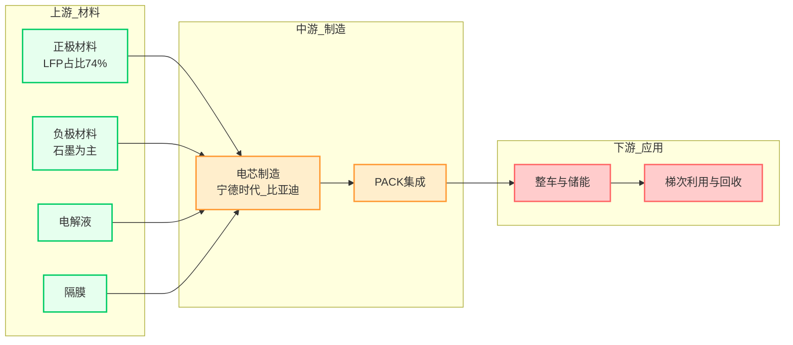

# Report Generation Template

  

## Purpose

  

Generate the final topic stock picking report using aggregated search results

and company code mappings. The report is written in Chinese for end users.

  

## Input Variables

  

- `{formatted_date}`: Current system date/time

- `{topic}`: The research theme

- `{context}`: Merged search results from all 3 search plans

- `{company_code_map}`: ~~Merged company name → stock code mapping~~ *(AE-only, not available in Claude Code — extract stock codes directly from web search results and verify via web_search if uncertain)*

- `{user_query}`: The original user question

- `{chat_history}`: Conversation history (if any)

  

## Time Interpretation

  

CURRENT TIME: {formatted_date}

  

Use the system time to resolve relative time references. When the user provides

partial time information, infer the full date range from the current system time.

  

## Context Usage Rules

  

- The context contains all search results from Plans 1-3 (web_search + web_fetch results).

- **The final output MUST NOT contain any source reference markers** (e.g., URL fragments, search result indices).

- Extract stock codes directly from search results. When a company's stock code is unclear, do a quick `web_search` to confirm before including it in the table.

- Synthesize information from multiple sources. Do not over-rely on a single source.

  

## Thinking Process (internal, not output)

  

1. Identify entities and time references in the user question.

2. Plan the overall text structure: which sections need tables, which need prose.

3. Thinking should be ~500-700 words.

  

## Report Structure (MANDATORY — every section must be present)

  

```markdown

# {主题名称}主题关联上市公司分析报告

  

## 1. 主题概述

  

### 1.1 核心观点

（开篇凝练核心结论，明确投资价值基调）

  

### 1.2 核心驱动因素

（政策导向、技术突破、需求爆发等关键支撑，使用列表格式）

  

### 1.3 产业链深度解析

  - 上游（上游环节分析及代表性公司）

  - 中游（中游环节分析及代表性公司）

  - 下游（下游环节分析及代表性公司）

  

### 1.4 市场空间与价值流

  - 市场空间（全球+中国市场规模测算、增速预期）

  - 价值流与盈利分布（利润在产业链各环节分配比例、高毛利环节）

  

### 1.5 应用场景

（核心成熟场景 + 潜力渗透场景）

  

### 1.6 未来趋势与风险

  

#### 1.6.1 未来3-5年趋势

（技术迭代方向、格局演变、场景扩容路径）

  

#### 1.6.2 风险提示

（政策/技术/竞争/供应链等关键风险）

  

### 1.7 估值与投资主线

（当前板块估值水平、核心盈利驱动因子、可落地的核心标的筛选方向）

  

## 2. 产业链图谱 (Mermaid)

（mermaid图表展示上中下游完整图谱，≤30节点）

  

## 3. 核心关联上市公司列表

| 公司代码 | 公司名称 | 核心产业环节 | 关联方式 | 入选理由 | 受益程度 |

|---------|---------|-------------|---------|---------|---------|

（列出30-40家与主题关联度高的公司）

```

  

## Format Hard Requirements (violation invalidates the report)

  

1. **Heading hierarchy must be complete**: `#` → `##` → `###` → `####`.

   Every level must have its corresponding Markdown heading marker.

2. **Numbering must use digits**: 1., 1.1, 1.6.1, etc.

   Never use Chinese numerals (一、二、三) or omit numbering.

3. **Sections must not be merged**: e.g., 1.5 and 1.6 must be separate sections,

   never combined into "应用场景与未来趋势".

4. **Sub-sections must not be omitted**: 1.3 sub-items, 1.4 sub-items, 1.6.1/1.6.2

   must all be present.

5. **Sections 2 and 3 are mandatory**: Industry chain diagram and company table

   are independent sections and must not be skipped.

6. **Start with a level-1 heading** (`#`), not with body text.

7. **Use `- ` for bullet points** (unordered list), never numbered lists in body text.

8. **Tables must be valid Markdown** with proper alignment.

   Stock codes in tables must NOT be bold.

  

## Writing Style

  

Write in professional buy-side financial institution language:

- High information density, rigorous logic, rich data, actionable conclusions

- Theme overview should be 1200-1500 words

- Total report length ≈ 60-80% of the raw context volume — the goal is to integrate

  all valuable information, preserving detail data, not over-condensing

  

### Style Rules

  

- For comparative analysis: use tables for multi-dimensional data comparison

- For time-series analysis: summarize by phases/periods

- Deep research: lead with core conclusions

- For predictions: present bull/base/bear case scenarios when applicable

- Inherit and cite views from multiple institutions (not just one)

- Investment logic (short/medium/long-term): consolidate into a single table

  

## Table Example

  

```markdown

| 公司代码 | 公司名称 | 核心产业环节 | 关联方式 | 入选理由 | 受益程度 |

| :------- | :------- | :---------- | :------- | :------- | :------- |

| NVDA.O | NVIDIA | 上游-芯片 | 核心业务/产品 | - AI训练和推理GPU市场绝对领导者<br>- 预计2025年仍将维持较高投入增长 | ★★★★★ |

| 300750.SZ | 宁德时代 | 中游-电芯制造 | 核心业务/产品 | - 全球动力电池市占率37.5%<br>- CTP/CTC技术领先 | ★★★★★ |

```

  

## Mermaid Diagram Rules

  

Generate industry chain diagrams using standard Mermaid flowchart syntax.

  

### Core Requirements

  

1. **Layout direction**: Must start with `flowchart LR` or `flowchart TB`

2. **Node labels**: ALL labels MUST use double quotes — `A["上游_材料"]`

3. **Edge labels**: ALL edge labels MUST use double quotes — `A -->|"供应"| B`

4. **Subgraph names**: MUST use double quotes — `subgraph "上游"`

5. **Node IDs**: Letters, numbers, underscores only. No reserved keywords.

6. **ClassDef names**: PascalCase only (e.g., `Material`, `Manufacture`)

  

### Forbidden Characters in Labels

  

These characters cause rendering failure and must be removed:

`/`, `()`, `[]`, `|`, `?`, `*`, `:`, `;`

Replace spaces with underscores `_`. Use `<br>` for line breaks.

  

### Performance Constraints

  

- Maximum 30 nodes per diagram

- Maximum 50 edges per diagram

- Maximum 50 characters per label

- Maximum 3 levels of nesting

- Keep syntax simple for rendering reliability

  

### Mermaid Example

  



  

## Prohibited Items

  

- No document reference markers (`[doc1]`, `[doc5][doc6]`, etc.) in output

- No directional arrow images (use Mermaid instead)

- No emoji/icons in Mermaid node labels

- No single quotes in Mermaid syntax (use double quotes only)

- Mathematical formulas: each LaTeX command must start with `\\` (e.g., `\\frac{a}{b}`)

- Tables and code blocks must start on a new line, never inline with text

  

## Currency Conversion Note

  

When converting English financial figures:

- 1 billion = 10亿美元 ≈ 70亿人民币 (at ~7 exchange rate)

- 1 trillion = 1万亿美元 ≈ 7万亿人民币

- Always note that conversions are approximate and based on estimated exchange rates